# MetroCity Smart City Traffic & Accident Analytics
### End-to-End AWS Data Engineering Pipeline | Python · PySpark · MySQL · Machine Learning · Power BI

<p align="center">
  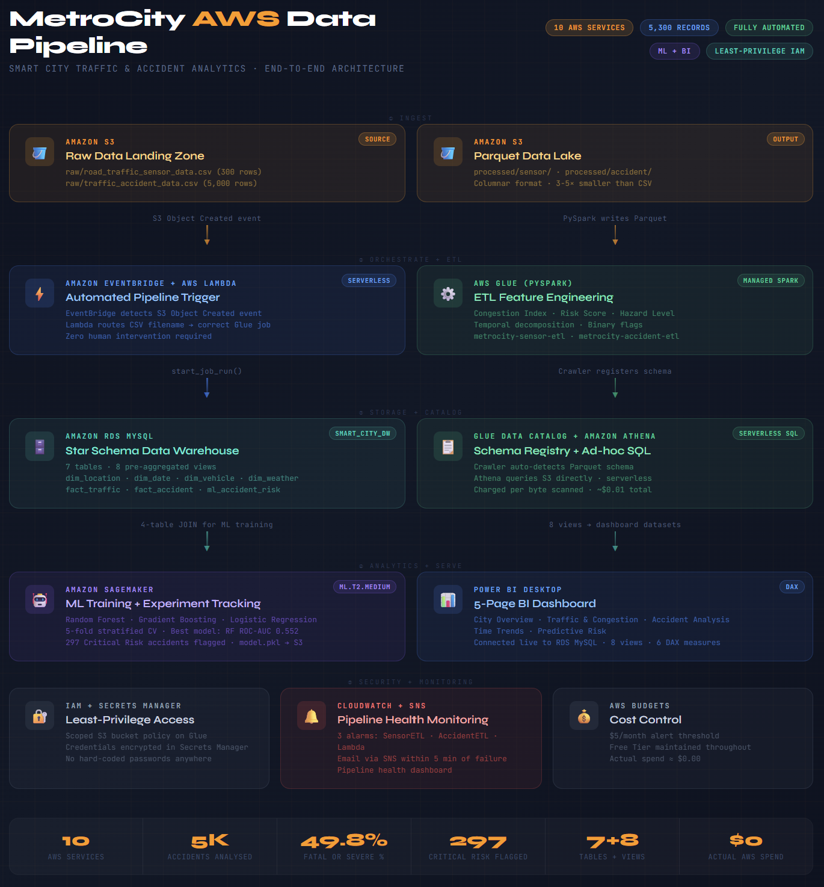
</p>

<p align="center">
  
  
  
  
  
</p>

---

## Project Summary

MetroCity is a rapidly growing urban hub with 300 traffic sensors across five zones and a growing road safety crisis. The city administration had 5,000 accident records and real-time sensor data but **no ability to turn raw readings into decisions** — no numeric congestion metric, no composite risk ranking, no predictive capability.

> **Note on the dataset:** The dataset used in this project is synthetically generated for case study purposes and does not fully capture real-world behavioral patterns or edge cases. Consequently, the machine learning results should be interpreted as a baseline demonstration of the pipeline rather than a production-optimized model.

This project builds a **complete smart traffic management system** that:
- Ingests raw CSV data automatically from Amazon S3
- Engineers four analytical KPIs that did not exist in the raw data
- Loads a star schema data warehouse into Amazon RDS MySQL
- Trains a machine learning classifier to predict accident severity
- Serves an interactive 5-page Power BI dashboard connected directly to AWS RDS

The pipeline is **fully automated** — uploading a CSV to S3 triggers the entire chain through EventBridge → Lambda → Glue → RDS without any human action.

> **Note on infrastructure:** All AWS resources shown in the screenshots were live during development. The free tier period has since ended and resources have been shut down. This repository preserves the complete code, architecture, results, and evidence of the working system.

---

## Architecture

```
                    ┌─────────────────────────────────────────┐
                    │            Amazon S3                    │
                    │  raw/ (CSV)  →  processed/ (Parquet)   │
                    │  ml-artifacts/ (model.pkl)              │
                    └───────┬─────────────────┬───────────────┘
                            │ Object Created   │ Glue writes Parquet
                            ▼                  │
                    ┌───────────────┐          │    ┌─────────────────┐
                    │  EventBridge  │          │    │  Glue Data      │
                    │  S3 rule      │          │    │  Catalog        │
                    └───────┬───────┘          │    └────────┬────────┘
                            │ invoke           │             │
                            ▼                  │    ┌────────┴────────┐
                    ┌───────────────┐          │    │  Amazon Athena  │
                    │  AWS Lambda   │          │    │  ad-hoc SQL     │
                    └───────┬───────┘          │    └─────────────────┘
                            │ start_job_run    │
                            ▼                  │
                    ┌───────────────────────┐  │
                    │    AWS Glue PySpark   │──┘
                    │  2 ETL jobs           │
                    └───────────┬───────────┘
                                │ load_rds.py
                                ▼
                    ┌───────────────────────┐
                    │   Amazon RDS MySQL    │
                    │   smart_city_dw       │
                    │   7 tables · 8 views  │
                    └──────┬────────────────┘
                           │              │
               ┌───────────┴──┐    ┌──────┴──────────────┐
               │  SageMaker   │    │    Power BI Desktop  │
               │  ML training │    │    5-page dashboard  │
               └──────────────┘    └─────────────────────┘

Monitoring: CloudWatch (3 alarms) + SNS (email) + AWS Budgets ($5/month)
Security:   IAM least-privilege roles + Secrets Manager (no hard-coded credentials)
```

---

## AWS Services Used

| Layer | Service | What it does |
|---|---|---|
| **Ingest** | Amazon S3 | Raw CSV landing zone · Parquet data lake · Model storage |
| **Trigger** | Amazon EventBridge | Detects S3 upload event, fires pipeline instantly |
| **Orchestrate** | AWS Lambda | Routes S3 filename to correct Glue ETL job |
| **ETL** | AWS Glue (PySpark) | Feature engineering: congestion index, risk score, hazard level |
| **Catalog** | Glue Data Catalog | Schema registry for Parquet tables, feeds Athena |
| **Warehouse** | Amazon RDS MySQL | Star schema: 7 tables, 8 pre-aggregated views |
| **Ad-hoc SQL** | Amazon Athena | Serverless queries on S3 Parquet, charged per byte |
| **ML** | Amazon SageMaker | Notebook training, experiment tracking, artifact storage |
| **Dashboard** | Power BI Desktop | 5-page BI dashboard connected live to RDS MySQL |
| **Security** | IAM + Secrets Manager | Scoped roles per service, encrypted credential storage |
| **Monitor** | CloudWatch + SNS | 3 failure alarms with email alerts within 5 minutes |
| **Cost** | AWS Budgets | $5/month guardrail, actual spend $3.00 |

---

## Dataset

| File | Rows | Columns | Date Range |
|---|---|---|---|
| `data/raw/road_traffic_sensor_data.csv` | 300 | 6 | Jan 1–13, 2024 |
| `data/raw/traffic_accident_data.csv` | 5,000 | 10 | Jan 1 – Jul 27, 2024 |

**5 Zones:** Downtown · Highway · Residential Zone · Industrial Area · Suburbs

The raw data had **zero engineered metrics** — every KPI was created during ETL.

---

## Engineered KPIs (Created in Glue PySpark)

| KPI | Formula | Purpose |
|---|---|---|
| **Congestion Index** | `0.6×(Vehicle_Count÷494) + 0.4×(1−Speed÷79)` | 0–1 numeric scale replaces Low/Moderate/High label |
| **Severity Score** | `Minor=1, Moderate=2, Severe=3, Fatal=4` | Ordinal encoding enables risk arithmetic |
| **Risk Score** | `Severity × log1p(Casualties+1) × Num_Vehicles` | Composite danger metric; log1p prevents Fatal+0-casualty scoring as zero |
| **Hazard Level** | `≤5=Low · 6–15=Moderate · 16–30=High · >30=Critical` | Actionable 4-tier bucket for emergency dispatch |

---

## Key Results

| Metric | Value |
|---|---|
| Total accidents | 5,000 |
| Total casualties | 22,467 |
| Fatal or Severe % | **49.8%** |
| Average Risk Score | **11.04** (range: 0.69–38.37) |
| Avg Congestion Index | **0.490** (range: 0.098–0.881) |
| High Congestion % | **32.0%** |
| Adverse weather % | 58.5% |
| ML best model ROC-AUC | **0.552** (Random Forest) |
| Critical Risk flagged | **297 accidents (5.9%)** |

### 3 Counterintuitive Findings

**1. Clear weather is the most dangerous condition**
Clear + Dry road = avg Risk Score **12.22** (highest). Fog + Wet = **10.72** (lowest). Drivers speed in good conditions; severity of collision increases with speed.

**2. Residential Zone is more congested than Highway**
Residential Zone CI = **0.570** vs Highway CI = **0.461**. Narrow streets and stop-sign density create more congestion per vehicle than open highway design.

**3. Accident frequency is flat 24/7, but severity peaks at Hour 11**
~209 accidents every hour with no peak spike. Risk Score peaks at **Hour 11 = 12.56** (14% above average). Standard peak-hour enforcement strategy is misaligned with true risk windows.

---

## Machine Learning

Binary classification: predict Fatal or Severe outcome (`is_fatal_or_severe = 1`)

| Model | Accuracy | F1 | ROC-AUC |
|---|---|---|---|
| **Random Forest ✓** | 0.550 | 0.519 | **0.552** |
| Gradient Boosting | 0.512 | 0.500 | 0.525 |
| Logistic Regression | 0.518 | 0.497 | 0.536 |

Top features: `hour (19.6%)` · `location (10.8%)` · `vehicle_type (10.6%)` · `month (10.0%)`

Risk Tier output: **297 Critical Risk** · 2,112 High Risk · 2,336 Moderate · 255 Low

---

## Dashboard Screenshots

| Page 1: City Overview | Page 2: Traffic & Congestion |
|---|---|
| 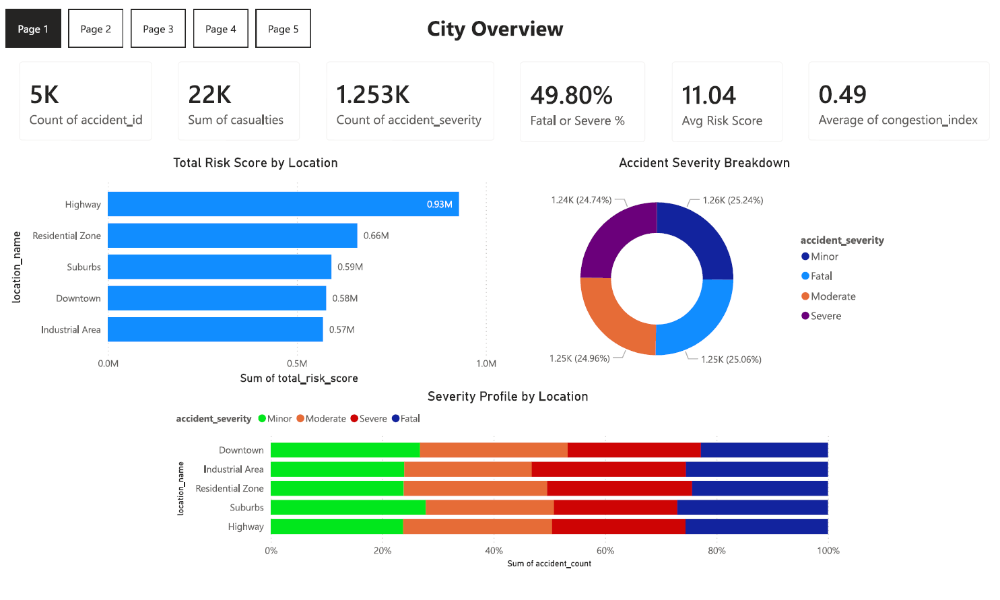 | 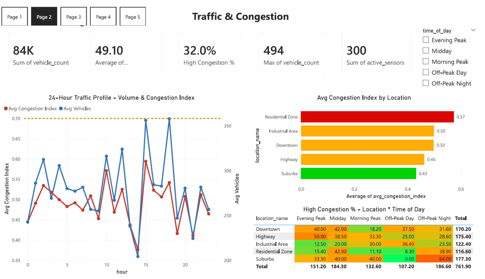 |
| 5K accidents · 22K casualties · 49.8% fatal/severe | Residential Zone most congested (CI 0.570) |

| Page 3: Accident Analysis | Page 4: Time Trends |
|---|---|
| 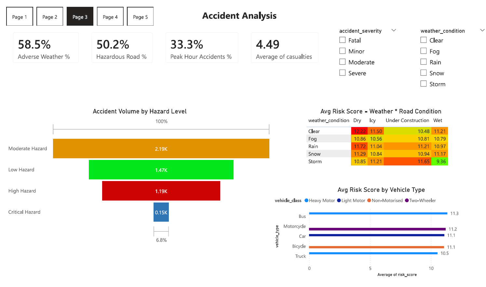 | 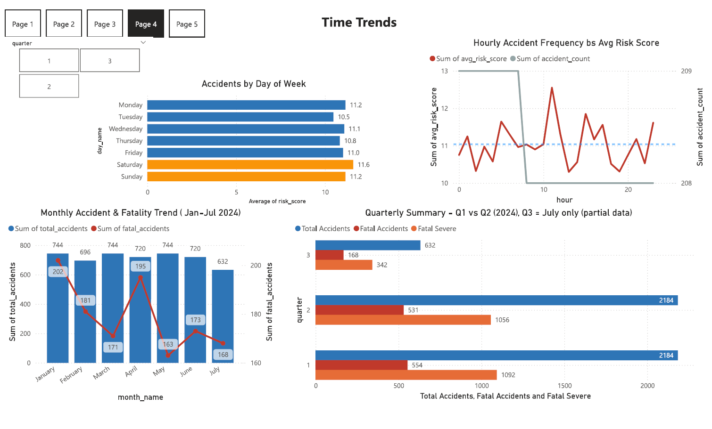 |
| Clear+Dry = highest risk — key counterintuitive finding | Severity peaks Hour 11, not morning rush |

| Page 5: Predictive Risk | SageMaker ML Training |
|---|---|
| 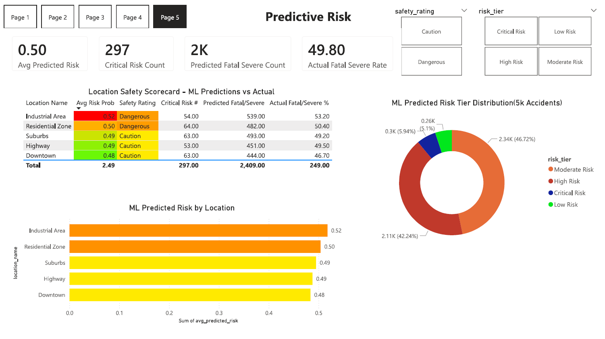 | 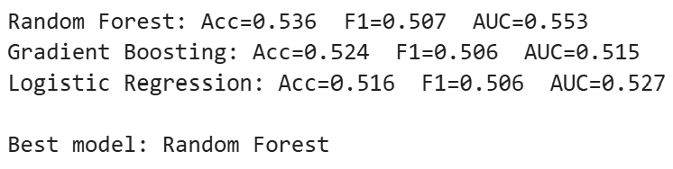 |
| 297 Critical Risk accidents flagged | Random Forest wins: AUC 0.552 |

---

## AWS Infrastructure Evidence

| Glue ETL Jobs — Both Succeeded | RDS Row Count Verification |
|---|---|
| 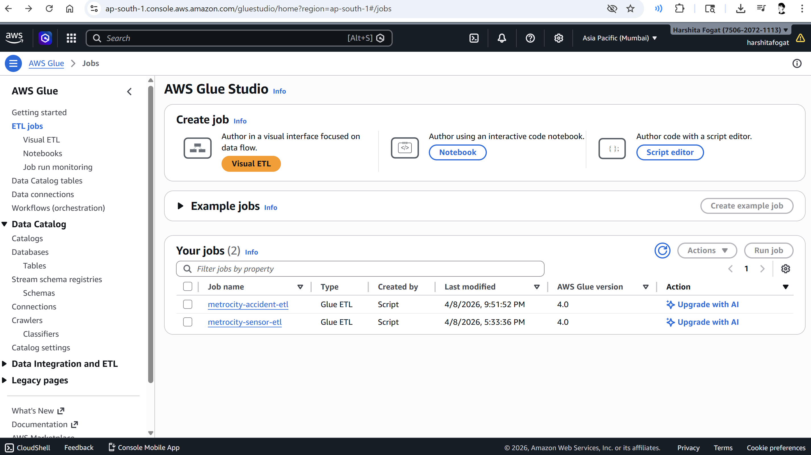 | 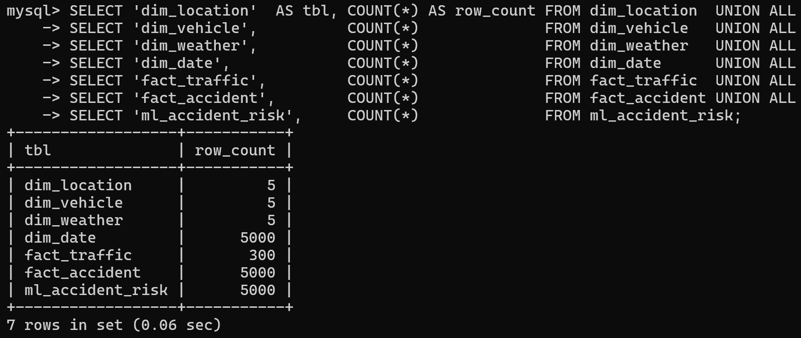 |

| EventBridge Rule — Enabled | CloudWatch — All Alarms OK |
|---|---|
| 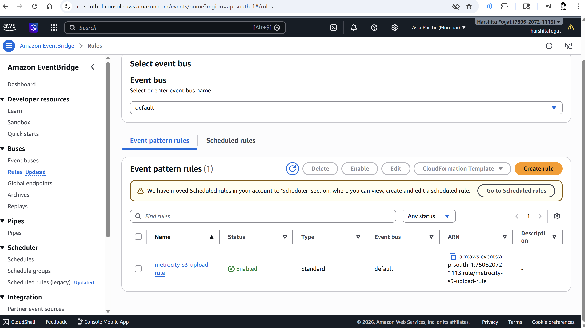 | 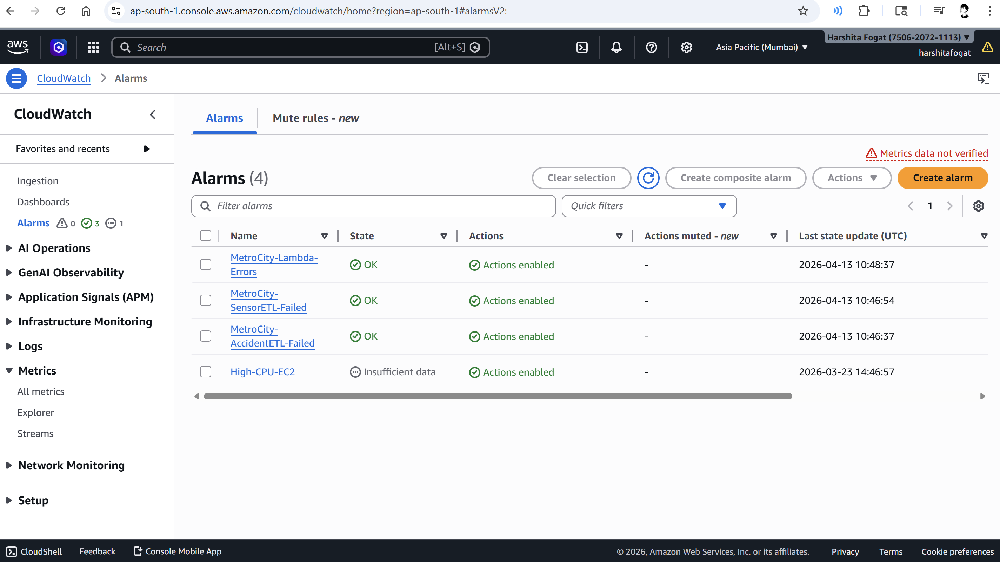 |

| IAM Least-Privilege Role | Secrets Manager — No Hard-coded Credentials |
|---|---|
| 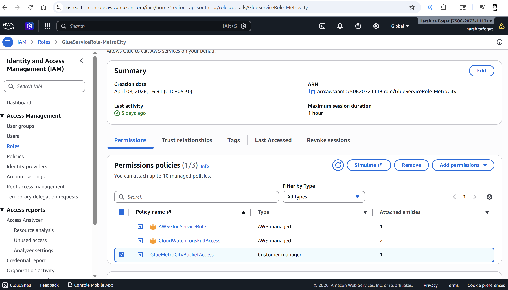 | 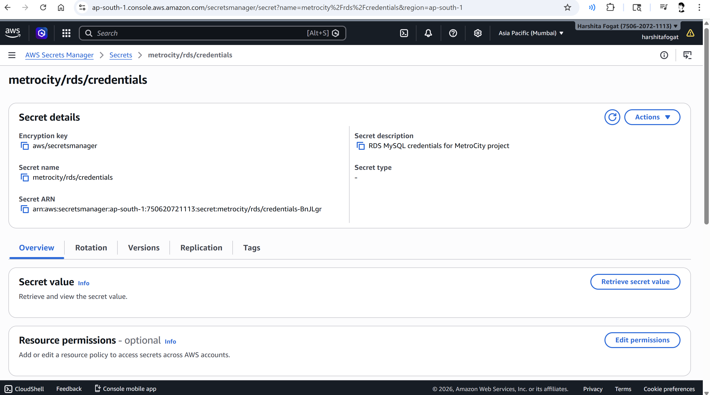 |

---

## Repository Structure

```
metrocity-aws-pipeline/
├── data/raw/                     ← Original source CSVs committed for reproducibility
├── etl/
│   ├── sensor_etl.py             ← Glue PySpark: congestion index, speed categories
│   └── accident_etl.py           ← Glue PySpark: risk score, hazard level, ML flags
├── warehouse/
│   ├── schema_ddl.sql            ← All 7 table CREATE statements
│   ├── load_rds.py               ← S3 Parquet → RDS loader (uses Secrets Manager)
│   └── all_views.sql       ← All 8 analytical views
├── ml/
│   └── severity_model.py         ← SageMaker: train, compare, score, log experiments
├── orchestration/
│   └── lambda_trigger.py         ← EventBridge → Lambda → Glue routing
├── monitoring/
│   ├── cloudwatch_alarms.bat     ← One-command alarm setup
│   └── iam_policies/             ← Least-privilege JSON policies
├── results/                      ← Project outputs committed as evidence
│   ├── powerbi/                  ← Complete PowerBI dashboard
│   ├── athena_sql_query_outputs/ ← View query results as CSV
│   └── ml_outputs/               ← Model comparison, feature importance, risk tiers
└── docs/
    └── screenshots/              ← AWS console screenshots (proof of live infrastructure)
```
---

## Reproduce This Project

```bash
# 1. Upload data to S3
aws s3 cp data/raw/road_traffic_sensor_data.csv s3://YOUR-BUCKET/raw/
aws s3 cp data/raw/traffic_accident_data.csv    s3://YOUR-BUCKET/raw/

# 2. Run Glue ETL
aws glue start-job-run --job-name metrocity-sensor-etl \
    --arguments '{"--BUCKET_NAME":"YOUR-BUCKET"}'
aws glue start-job-run --job-name metrocity-accident-etl \
    --arguments '{"--BUCKET_NAME":"YOUR-BUCKET"}'

# 3. Build RDS warehouse
mysql -h YOUR-ENDPOINT -u admin -p smart_city_dw < warehouse/schema_ddl.sql
python warehouse/load_rds.py
mysql -h YOUR-ENDPOINT -u admin -p smart_city_dw < warehouse/all_views.sql

# 4. ML training — run ml/severity_model.py in SageMaker Notebook (conda_python3)

# 5. Set up monitoring
# bash monitoring/cloudwatch_alarms.bat
monitoring\cloudwatch_alarms.bat

# 6. Connect Power BI Desktop to RDS endpoint on port 3306
```

---

**Harshita Fogat** · Data Engineer
